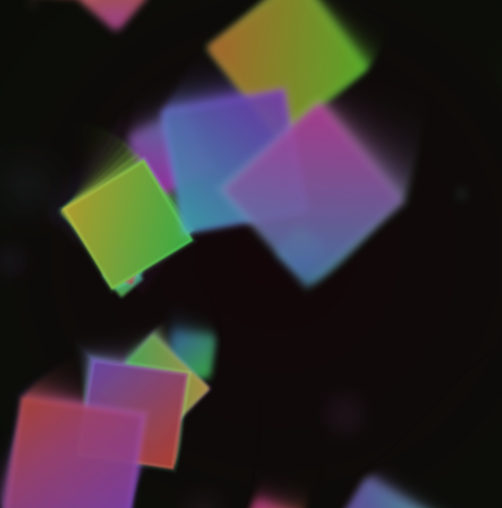

# Dreamy Falling Squares

和菓子のような淡い色合いで、グラデーションの正方形がくるくる回りながら降ってくる  
幻想的なスクリーンセイバー風アート（Vanilla JavaScript + HTML5 Canvas）。

---

## Demo

[Live Demo](https://demo.kareha.org/falling-squares/)

---

## Features

- **グラデーション正方形**  
  回転しながら落下。残像つきで幻想的に。

- **和菓子のような配色**  
  彩度を抑えた二色グラデーションと縁の発光のみで柔らかい印象。

- **残像と露出調整**  
  白飛びを抑えつつ長い軌跡が残る。

- **背景グラデーション**  
  ゆっくり色相が循環する生きた背景。

- **マウス操作**  
  スペース/クリックで一時停止。`M` キーでマウス引力ON/OFF。

---

## How to Use

1. このリポジトリを clone または zip ダウンロード  
2. `dreamy-squares.html` をブラウザで開く  
3. フルスクリーンにするとスクリーンセイバー風に楽しめます

---

## Customization

- `NUM_SQUARES` / `NUM_BOKEH` : オブジェクト数（軽量化用に調整可）
- `TRAIL` : 残像の強さ (0.0〜0.4)
- `EXPOSURE` : 全体の露出 (0.6〜0.85 推奨)
- `DOF_BLUR_MAX` : 被写界深度の強さ
- その他コード先頭の定数で調整可能

---

## Credits

- Generated with **ChatGPT 5** (OpenAI)  
- Code reviewed & tuned by Aki Kareha

---

## License

[MIT License](LICENSE)
